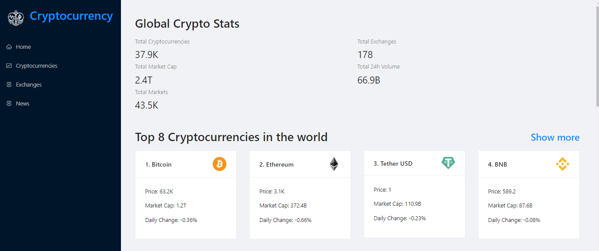

# Cryptocurrency
This website shows real-time prices of cryptocurrencies using the Rapid API.



Live: currently working [****]()

## Technologies Used
- ReactJS 18.1.0
- html-react-parse: 1.4.12
- Redux Toolkit 2.2.3
- Rapid Api v2
- Antd 4.7
- Chart.js 3.7.1

install npm:
```npm install ```

for running the project:```npm run```

after running the project you have to make ```.env``` file which include this:


```

REACT_APP_RAPIDAPI_KEY =  
REACT_APP_CRYPTO_API_URL =
REACT_APP_NEWS_API_URL = 
REACT_APP_NEWS_RAPIDAPI_HOST = 
 REACT_APP_CRYPTO_RAPIDAPI_HOST =
```

After this go to [**RapidAPI**](https://rapidapi.com/Coinranking/api/coinranking1) and then use the api  

## References
[**JavaScript Mastery**](https://www.youtube.com/watch?v=9DDX3US3kss)
